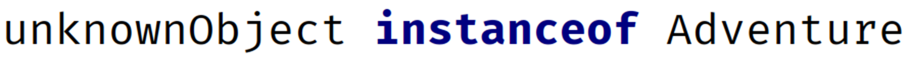

### instanceof operator ###

The instanceof operator, lets you test the type of an object or instance.
The reference variable you are testing, is the left operand.
The type you are testing for, is the right operand.

It's important to see that Adventure is not in quotes, meaning we're not testing the type name, but the actual type.
This operator returns true, if unknownObject is an instance of Adventure.