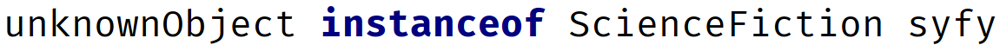

### instanceof operator ###

The instanceof operator, lets you test the type of an object or instance.
The reference variable you are testing, is the left operand.
The type you are testing for, is the right operand.

It's important to see that Adventure is not in quotes, meaning we're not testing the type name, but the actual type.
This operator returns true, if unknownObject is an instance of Adventure.

##
### Pattern matching support for the instanceof operator ###

From JDK16 up

If the JVM can identify that the object matches the type, it can extract data from the object, without casting.
For this operator, the object can be assigned to a binding variable, which here is called syfy.
From our example:

The variable syfy (if the instanceof method returns true) is already typed as a ScienceFiction variable.

In our code, we do not need to create a variable in the block statement and we do not have to cast it either.

